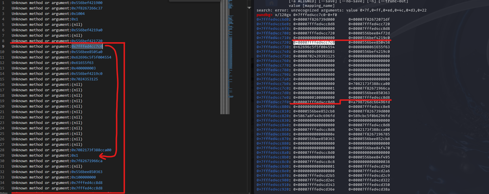
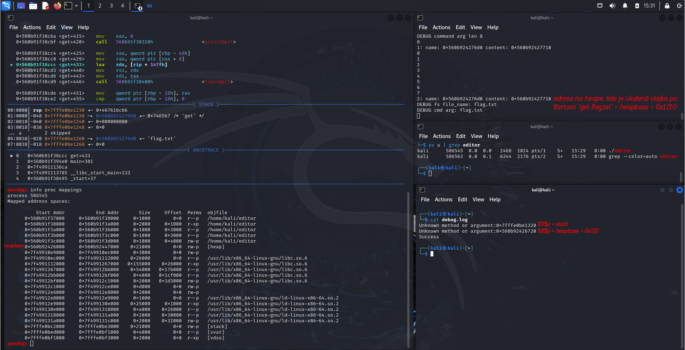
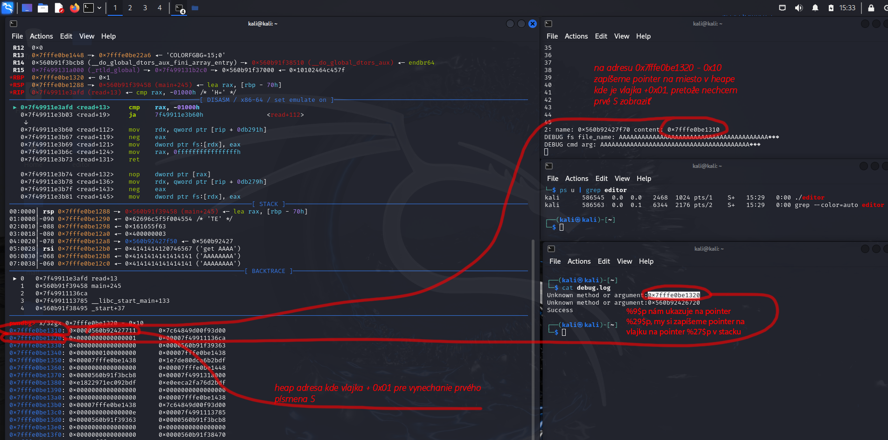
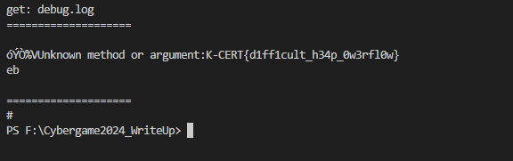

┌──(kali㉿kali)-[~]  
└─$ checksec editor  
[*] '/home/kali/editor'  
    Arch:     amd64-64-little  
    RELRO:    Full RELRO  
    Stack:    Canary found  
    NX:       NX enabled  
    PIE:      PIE enabled  

Z tohto nám vyplýva, že možnosti je málo. Treba sa zamerať na niečo konkétne.

Po dôkladnej statickej analýze som prišiel na to, že aplikácia odomňa pýta príkazy. Pokiaľ som neprihlásený, jediné príkazy, ktoré vezme sú login a exit. exit ukončí aplikáciu, login umožní prihlásiť sa menom a heslom guest:guest
Po prihlásení je možné zadať ďalšie príkazy a to get a put, pričom za nimi očakáva argument s názvom súboru.

Prvá zraniteľnosť bola v debug_msg() funkcii, kde nebol zadaný format specifier, čo nám umožní leaknuť pointre a rovnako stringy na pointeroch. Tu som použil pointers.py, aby mi iteráciou jednotlivých pointerov ukázalo bajtyv stacku. Zistil som, že od pointera _\%9\$p_ vidím pomocou pointerov hodnoty v stacku a samotný pointer _\%9\$p_ mi ukazuje na pointer _\%29\$p_

Pre nás zaujímavý ďalší pointer bol "\%8\$p", ktorý nás nasmeroval na adresu v heape vždy s offsetom +0x720 (heap base je teda pointer - 0x720). Adresy sme si printli pomocou príkazu "get debug.log" alebo počas debugovania aj pomocou terminálu a príkazu "cat debug.log".

└─$ nc 127.0.0.1 2222  
Enter commands (type 'exit' to quit):  
\> \%9\$p  
\> \%8\$p  
\> login  
username> guest  
password> guest  
\# get debug.log   
get: debug.log  
\====================  
Unknown method or argument:0x7fffffffdd60 (stack)  
Unknown method or argument:0x55555555a720 (heap)  
Success  
  
\====================  

Ďalej, keďže heap nie je taký stabilný ako stack a po príkaze free sa uvoľní pamať, keď si chcem uložiť vlajku do pamaäte, po ďalších operáciach mi ju môže program prepísať. Ja osobne som si vlajku dal zapísať do pamäte 4x, just in case.

Po viacerých spusteniach som zistil, že offset od heap base pre uloženú vlajku číslo 4, je vždy _+0x1710_

Ďalší postreh bol, že funkcia get si alokuje v heape 48 bajtov pre zápis názvu súboru, ktorý číta, ale na adresu kde to zapisuje +0x28 (bajty 41-48) zapíše adresu, na ktorú funckia strncat zapíše obsah súboru. Názov súboru ale mohol byť dlhý až 70 bajtov (69 + null terminator, takže len 69). Funkcia put nám umožní zapísať do súboru 20 bajtov.

Exploit teda spočíval v tom, že blízko adresy v stacku, ktorú sme printli z debug.log zapíšeme adresu z heapu, kde sa nám načítal súbor z vlajkou...  

Pomocou """put 40x"A" + (adresa_stacku-0x20_napr)"""  vytvoríme súbor,
keď klient vypýta   
text\> zadáme adresu heapu, kde máme vlajku + jeden bajt (heap base + 0x1711)
pomocou get 40xA + adresa_stacku-0x20 prepíšeme adresu, kam sa zapíše obsah súboru (musí existovať ten súbor, preto ten put najskôr) a do toho stacku tak zapíšeme pointer, kde je obsah vlajky bez prvého znaku

>_Poznámka: vlajku nedokážeme vyčítať priamo, pretože pokiaľ riadok obsahu súboru obsahuje substring SK-CERT, funckia get tento riadok neprintne._

Keďže na týchto adresách obsah vlajky začínal štandardne SK-CERT, potrebujem vynechať aspoň jedno písmenko, takže pointer + 0x1 (heapbase+0x1711). 

Pointer, ktorý ma nasmeruje na adresu heapu, kde mám vlajku bez prvého S som sa rozhodol zapísať na stack na pointer \%27\$p funkcie debug_msg().

Tento pointer si dokážeme prečítať, no dokážeme si aj zobraziť obsah čo je na adrese, na ktorú nám daný pointer ukazuje a keďže som sa rozhodol to zapísať na pointer s indexom 27, zobrazíme ho pomocou specifiera _\%27\$s_

Následne len použiť ako príkaz \%_27_\$s a nakoniec použiť "get debug.log" a máme tam vlajku bez prvého S

## Vlajka:  
### SK-CERT{d1ff1cult_h34p_0w3rfl0w}